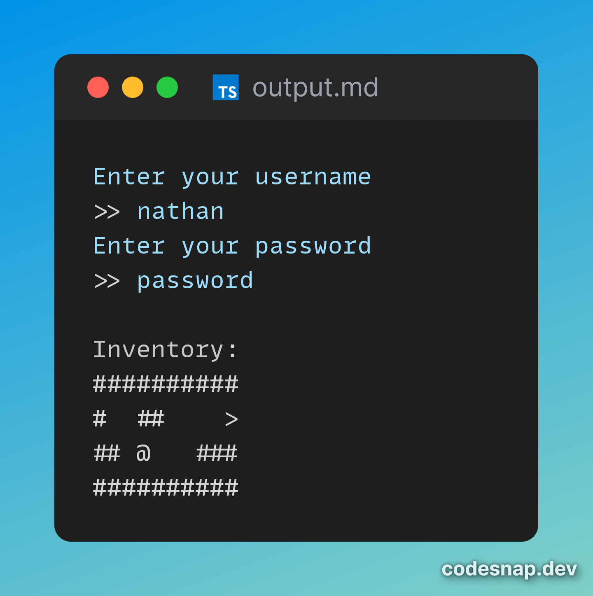

# Tests
| Test Name          | Login (normal)                      | Login (erroneous)                     | Collisions                            | End                | Lock and Key                                                         | Chests               |
|:------------------:|:-----------------------------------:|:-------------------------------------:|:-------------------------------------:|:------------------:|:--------------------------------------------------------------------:|:--------------------:|
| Action             | Enter correct username and password | Enter incorrect username and password | Move into wall                        | Walk to end square | Walk to lock, walk to key, walk to lock                              | Move to chest        |
| Expected results   | User can play game                  | User cannot play gaame                | Player returns to original position   | Game finishes      | Player cannot move to it, player picks up key, player can move to it | Player collects loot |
| Actual results     | Usercan play game if uname and pword correct | User cannot play game        | Player cannot move into walls         | Game ends and displays | It works                                                         | Player gets random loot added to inv |
| Images             |  |  |  |  |  | 
